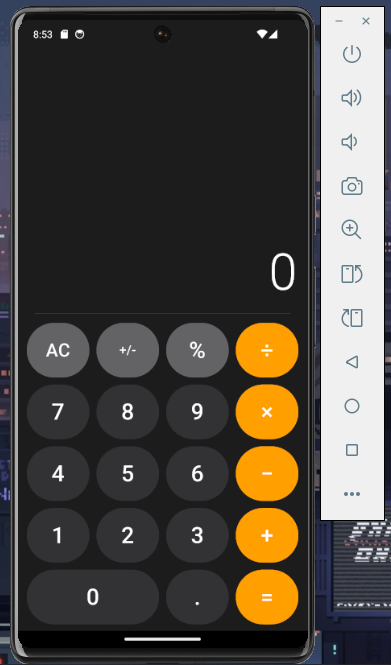
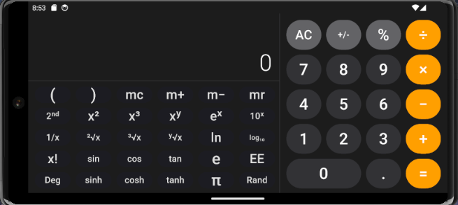

# Máy Tính Khoa Học (Flutter Scientific Calculator)

Ứng dụng máy tính được xây dựng bằng Flutter, cung cấp giao diện và trải nghiệm tương tự ứng dụng máy tính mặc định trên iOS. Ứng dụng hỗ trợ thay đổi bố cục linh hoạt theo hướng màn hình: chế độ cơ bản (dọc) và chế độ khoa học (ngang).

<p align="center">
  
  &nbsp;&nbsp;&nbsp;&nbsp;
  
</p>

## Tính năng chính

### Giao diện (UI/UX)
- Thiết kế tối giản, trực quan.
- **Tự động thay đổi bố cục (Responsive Layout):**
  - Màn hình dọc (Portrait): Bàn phím máy tính cơ bản.
  - Màn hình ngang (Landscape): Bàn phím khoa học với cấu trúc 6 cột.
- Hiệu ứng chuyển động (animations) và phản hồi chạm mượt mà.

### Logic tính toán lõi
- Xây dựng bộ phân tích biểu thức tùy chỉnh dựa trên **thuật toán Shunting-Yard**, tuân thủ nghiêm ngặt thứ tự ưu tiên phép tính (BEDMAS / PEMDAS).
- **Nhân ngầm định (Implicit Multiplication):** Tự động phân tích và xử lý các biểu thức như `2(3+4)` thành `2*(3+4)`, hoặc `2π` thành `2*π`.
- Hỗ trợ toán tử âm (unary minus) tại bất kỳ vị trí nào trong biểu thức, kể cả ngay sau dấu ngoặc mở.
- Tự động xử lý các sai số dấu phẩy động (floating-point precision) phổ biến (ví dụ: `0.1 + 0.2` hoặc các giá trị giới hạn của hàm lượng giác).

### Chức năng khoa học
- **Lượng giác:** `sin`, `cos`, `tan` (Hỗ trợ chuyển đổi nhanh giữa chế độ **Radian** và **Độ**).
- **Hàm nâng cao:** Bình phương (`x²`), Lập phương (`x³`), Căn bậc 2 (`√`), Căn bậc 3 (`³√`), Giai thừa (`x!`), Logarit cơ số 10 (`log₁₀`), Logarit tự nhiên (`ln`), Hàm mũ (`eˣ`, `10ˣ`), Nghịch đảo (`1/x`).
- **Hằng số:** `π` (Pi), `e` (Euler).
- Kiểm soát lỗi chặt chẽ đối với các phép toán không hợp lệ (ví dụ: Chia cho 0, Căn bậc 2 của số âm, `tan(90°)`).

### Chức năng bổ trợ
- **Lặp phép tính (Repeat Equals):** Nhấn phím `=` liên tiếp để tự động lặp lại phép toán cuối cùng (Ví dụ: `1 + 1 = 2`, nhấn tiếp `=` sẽ cho ra `3`, `= 4`...).
- Lưu trữ lịch sử tính toán và hiển thị trực tiếp biểu thức đang thao tác (Pending Expression) trên màn hình chính.
- Nút `AC` (All Clear) thực hiện xóa trạng thái an toàn, bảo toàn thiết lập đơn vị góc (Rad/Deg) hiện tại của người dùng.

## Công nghệ sử dụng

- **Framework:** Flutter / Dart
- **Quản lý trạng thái (State Management):** Riverpod (`StateNotifierProvider`) đảm bảo luồng dữ liệu đơn chiều và trạng thái bất biến (immutable state).
- **Kiểm thử (Testing):** Độ bao phủ logic đạt 100% với hơn 70 unit tests.

## Cài đặt

1. Clone repository:
   ```bash
   git clone <repository-url>
   cd Calculator
   ```

2. Cài đặt các thư viện phụ thuộc (dependencies):
   ```bash
   flutter pub get
   ```

3. Chạy ứng dụng:
   ```bash
   flutter run
   ```

## Chạy kiểm thử (Unit Tests)

Khởi chạy bộ kiểm thử toàn diện của hệ thống bằng lệnh:
```bash
flutter test test/core/models/calculator_notifier_test.dart
```

## 📁 Cấu trúc thư mục dự án

Dự án được tổ chức gọn gàng theo sự phân tách giữa lớp Giao diện (UI) và lớp Logic cốt lõi (Core), giúp mã nguồn dễ đọc, dễ mở rộng và kiểm thử độc lập:

```text
lib/
├── core/                       # ⚙️ LỚP CỐT LÕI & LOGIC NGHIỆP VỤ (Hoàn toàn độc lập với UI)
│   ├── logic/                  # Chứa các thuật toán phân tích và tính toán thuần túy
│   │   └── expr_evaluator.dart # Bộ đánh giá biểu thức (Shunting-Yard, BEDMAS/PEMDAS)
│   └── models/                 # Quản lý trạng thái (State Management) bằng Riverpod
│       ├── calculator_state.dart     # Định nghĩa các trạng thái bất biến (Immutable State)
│       └── calculator_notifier.dart  # Lớp điều khiển (Notifier) xử lý sự kiện nhập số, tính toán
│
├── ui/                         # 🎨 LỚP GIAO DIỆN (Vẽ màn hình & nhận tương tác người dùng)
│   ├── screens/                # Chứa các màn hình hoàn chỉnh
│   │   └── calculator_screen.dart    # Màn hình chính xử lý UI Responsive (bố cục dọc/ngang)
│   ├── theme/                  # Cấu hình phong cách thiết kế chung
│   │   └── colors.dart, vv...        # Tập trung bảng màu, typography, khoảng cách thống nhất
│   └── widgets/                # Các thành phần UI nhỏ gọn, tái sử dụng ở nhiều nơi
│       └── button_tile.dart          # Nút bấm tùy chỉnh của máy tính với hiệu ứng chuyển động
│
└── main.dart                   # 🚀 ĐIỂM BẮT ĐẦU (Entry point), cấu hình ProviderScope và hướng xoay
```
